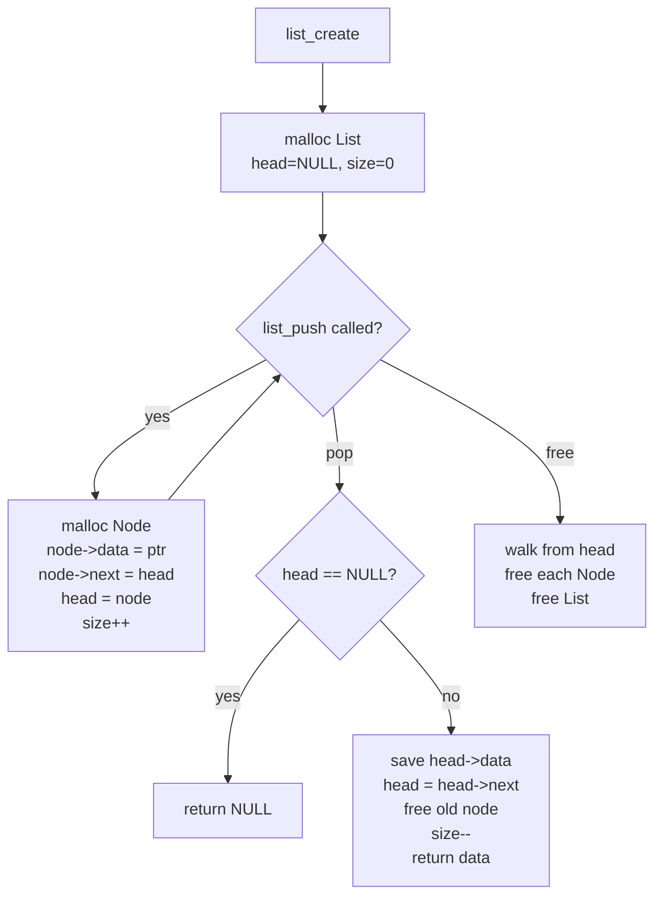
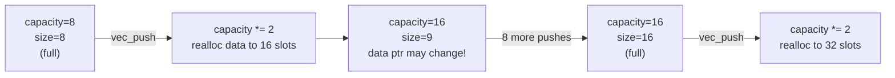
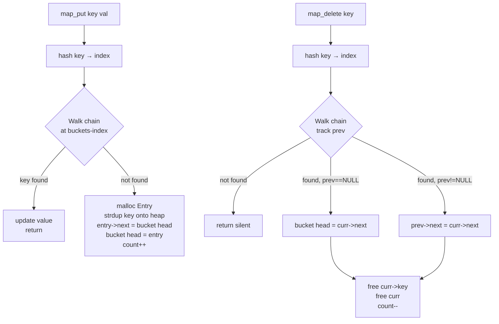
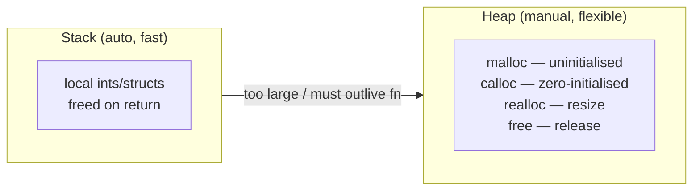
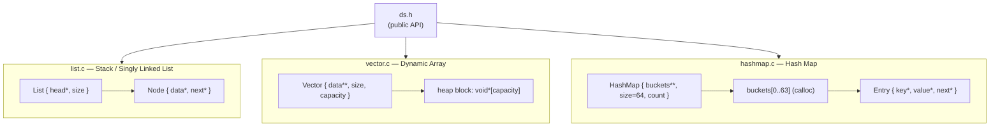

# C Data Structures — Handwritten from Scratch

A personal learning project implementing three fundamental data structures in pure C, with manual memory management, generic `void *` storage, and AddressSanitizer validation.

---

## Project Map

```
datastructures/
├── ds.h            ← single public header (all three APIs)
├── list.c          ← singly-linked list (stack behaviour)
├── vector.c        ← dynamic array with doubling growth
├── hashmap.c       ← 64-bucket hash map with chaining
├── test_list.c     ← push / pop / free tests
├── test_vector.c   ← push / get + realloc stress test
├── test_hashmap.c  ← put / get / update / delete tests
└── Makefile        ← clang + ASan, per-structure targets
```

---

## How to Build & Run

```bash
# compile and run each structure independently
make test_list    && ./test_list
make test_vector  && ./test_vector
make test_hashmap && ./test_hashmap

# clean all object files and binaries
make clean
```

**Compiler flags used:**
```
-Wall -Wextra -pedantic   # strict warnings
-g                        # debug symbols
-fsanitize=address        # ASan: catches leaks, UAF, OOB
```

---

## Data Structure 1 — Singly Linked List

### What it is
A chain of heap-allocated nodes. New items are inserted at the **head** (O(1) push), and removed from the **head** (O(1) pop). This makes it a **stack (LIFO)**.

### Internal layout

```
List { head → [Node] → [Node] → [Node] → NULL, size }
              data=&c   data=&b   data=&a
```

### Struct layout

```c
typedef struct Node {
    void *data;       // pointer to caller-owned data
    struct Node *next;
} Node;

typedef struct List {
    Node *head;       // top of the stack
    int   size;
} List;
```

### API

| Function | Behaviour | Complexity |
|---|---|---|
| `list_create()` | malloc the List, head = NULL | O(1) |
| `list_push(list, ptr)` | malloc Node, insert at head | O(1) |
| `list_pop(list)` | remove head, free Node, return data ptr | O(1) |
| `list_size(list)` | return list->size | O(1) |
| `list_free(list)` | walk & free every Node, then free List | O(n) |

### Flow diagram



### Key insight: push prepends to the head
```
Before push(&c):   head → [b] → [a] → NULL
After  push(&c):   head → [c] → [b] → [a] → NULL
```
Pop always removes from the left (most-recently-pushed). Pure LIFO.

---

## Data Structure 2 — Dynamic Array (Vector)

### What it is
A contiguous block of `void *` pointers, managed on the heap. Starts with capacity 8. When full, **doubles** capacity via `realloc`. Random access is O(1).

### Internal layout

```
Vector {
    data → [ *0 | *1 | *2 | *3 | *4 | *5 | *6 | *7 | ... ]  ← heap block
    size     = 5         (items actually stored)
    capacity = 8         (slots allocated)
}
```

### Struct layout

```c
typedef struct Vector {
    void **data;      // pointer to heap array of void-pointers
    int   size;
    int   capacity;
} Vector;
```

### API

| Function | Behaviour | Complexity |
|---|---|---|
| `vec_create()` | malloc Vector, malloc data[8] | O(1) |
| `vec_push(v, ptr)` | append; realloc×2 when full | amortised O(1) |
| `vec_get(v, i)` | bounds-checked index access | O(1) |
| `vec_size(v)` | return v->size | O(1) |
| `vec_free(v)` | free(data), free(v) | O(1) |

### Growth diagram



### The `realloc` contract
```c
void **new_data = realloc(v->data, v->capacity * sizeof(void *));
if (!new_data) return;   // old block untouched on failure
v->data = new_data;      // update pointer — old address may be invalid now
```
Always assign to a **temporary** before overwriting `v->data`. If you wrote `v->data = realloc(v->data, ...)` and realloc returned NULL, you'd lose the original pointer — a memory leak.

---

## Data Structure 3 — Hash Map

### What it is
An array of 64 **buckets**, each the head of a singly-linked list of `Entry` nodes. A hash function maps a string key to a bucket index. Collisions are handled by **chaining** (appending to the linked list in that bucket).

### Internal layout

```
HashMap {
    buckets[0]  → NULL
    buckets[1]  → [Entry: "bob",87] → NULL
    ...
    buckets[17] → [Entry: "alice",95] → [Entry: "carol",92] → NULL
    ...
    buckets[63] → NULL
    size  = 64
    count = 4
}
```

### Struct layout

```c
typedef struct Entry {
    char         *key;    // heap-allocated copy (owned by HashMap)
    void         *value;  // pointer to caller-owned data
    struct Entry *next;   // chaining for collision resolution
} Entry;

typedef struct HashMap {
    Entry **buckets;  // calloc'd array of 64 Entry* (all NULL initially)
    int     size;     // always BUCKET_COUNT (64)
    int     count;    // live entries
} HashMap;
```

### API

| Function | Behaviour | Complexity |
|---|---|---|
| `map_create()` | malloc HashMap, **calloc** 64 buckets | O(1) |
| `map_put(map, key, val)` | hash key → bucket; update if exists, else prepend new Entry | O(1) avg |
| `map_get(map, key)` | hash key → walk chain → return value or NULL | O(1) avg |
| `map_delete(map, key)` | find entry, splice out of chain, free key + entry | O(1) avg |
| `map_count(map)` | return map->count | O(1) |
| `map_free(map)` | walk all 64 buckets, free every entry + key, free buckets, free map | O(n) |

### Hash function — DJB2

```c
static unsigned int hash(const char *key) {
    unsigned int h = 5381;
    int c;
    while (*key != '\0') {
        c = *key;
        key++;
        h = ((h << 5) + h) + c;   // h * 33 + c
    }
    return h % BUCKET_COUNT;       // 0..63
}
```
`h * 33 + c` is the DJB2 algorithm. The magic number 33 (5 left-shifts + original) and seed 5381 are empirically chosen for low collision rates on ASCII strings.

### put / delete flow



### Key vs Value ownership — the critical distinction

```
Key   → HashMap OWNS it. We malloc + strcpy the key inside map_put.
        Caller's string can be freed/modified freely after the call.

Value → Caller OWNS it. We only store the pointer.
        Caller is responsible for freeing the value when done.
```

This is why `map_free` calls `free(curr->key)` but **never** `free(curr->value)`.

### Why `calloc` for buckets?

```c
map->buckets = calloc(BUCKET_COUNT, sizeof(Entry *));
```
`calloc` zero-initialises all 64 slots → all bucket heads start as `NULL`. With `malloc`, they'd contain garbage — every `while (curr)` walk would crash or loop forever.

---

## Memory Management Master Reference



### When to use each

| Use **Stack** when | Use **Heap** when |
|---|---|
| Small, fixed-size data | Must outlive current function |
| Only needed inside current function | Size unknown at compile time |
| Temporary / short-lived | Large data |
| | Shared across multiple call sites |

### The three malloc patterns used here

```c
// 1. Single struct
List *list = malloc(sizeof(List));

// 2. Array of pointers (zero-init required)
map->buckets = calloc(BUCKET_COUNT, sizeof(Entry *));

// 3. Array resize — always use temp pointer
void **new_data = realloc(v->data, new_cap * sizeof(void *));
if (!new_data) return;   // handle failure before overwriting
v->data = new_data;
```

---

## Full Architecture Overview



---

## 80/20 Summary — The 20% that covers 80% of the concepts

### 1. `void *` is the C generics system
Every data structure stores `void *`. The caller casts on retrieval. This is how C achieves type-agnostic containers without templates or generics.

### 2. Structs are hidden behind the header
The `struct` definitions live in the `.c` files, not in `ds.h`. Callers only see `typedef struct List List;` — they can't poke internal fields. This is **opaque pointer** encapsulation, C's version of private members.

### 3. Linked List = Stack
`list_push` inserts at head. `list_pop` removes from head. Last-in, first-out. Size is tracked so you never traverse to count.

### 4. Vector doubles capacity on full
Start at 8, double to 16, 32, 64, … Each item costs O(1) amortised because doublings get rarer as the array grows. Always save the `realloc` return to a temp — never overwrite the original pointer directly.

### 5. HashMap = array of linked lists
64 fixed buckets. DJB2 hash maps a string to `0..63`. Collisions chain as a linked list in that bucket. Average O(1) for all operations assuming good distribution.

### 6. Key ownership vs value ownership
HashMap copies the key onto the heap (caller can free their string). Value pointer is borrowed — HashMap never frees it. This is the core memory-ownership pattern for any C container.

### 7. `calloc` vs `malloc`
Use `calloc` when zero-initialisation is correctness-critical (bucket array of pointers must start as `NULL`). Use `malloc` when you'll immediately overwrite every byte.

### 8. Free in reverse order of allocation
For every structure: free the **contents** first, then the **container**. Free the Node before walking to the next. Free `buckets` entries before freeing `buckets`. Free `buckets` before freeing `HashMap`.

### 9. AddressSanitizer is your memory debugger
`-fsanitize=address` catches: buffer overflows, use-after-free, double-free, memory leaks. Run it every time. It costs nothing in dev.

### 10. The `prev` pointer in delete
Deleting from a singly-linked list needs two cursors: `curr` (the target) and `prev` (its predecessor). If `prev == NULL`, the target was the head — update `bucket[index]` directly. Otherwise splice: `prev->next = curr->next`.

---

## Quick Reference Card

```
LINKED LIST              VECTOR                   HASHMAP
─────────────────────    ──────────────────────   ──────────────────────────
list_create()            vec_create()             map_create()
list_push(l, ptr)        vec_push(v, ptr)         map_put(m, "key", ptr)
list_pop(l) → ptr        vec_get(v, i) → ptr      map_get(m, "key") → ptr
list_size(l) → int       vec_size(v) → int        map_delete(m, "key")
list_free(l)             vec_free(v)              map_count(m) → int
                                                  map_free(m)

Structure:               Structure:               Structure:
  head → Node chain        void*[capacity]          64 buckets
  LIFO (stack)             contiguous, O(1) read    chained entries
  O(1) push/pop            amortised O(1) append    O(1) avg all ops
```
